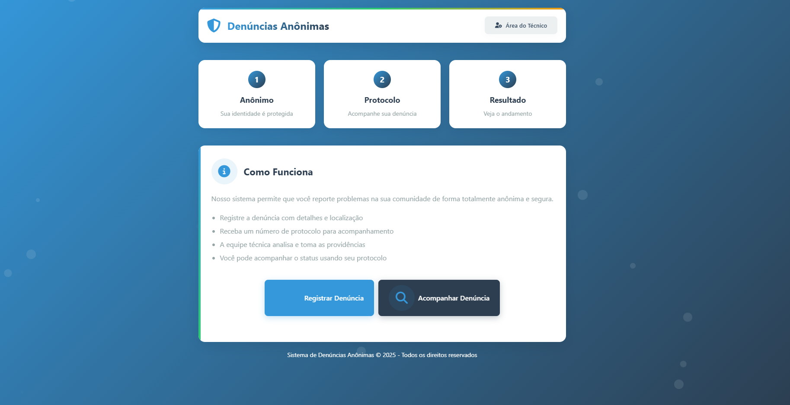
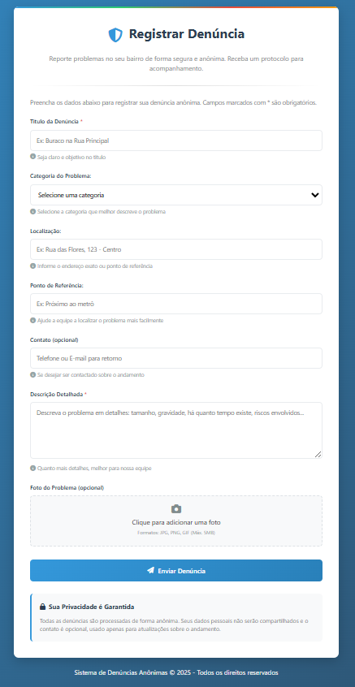
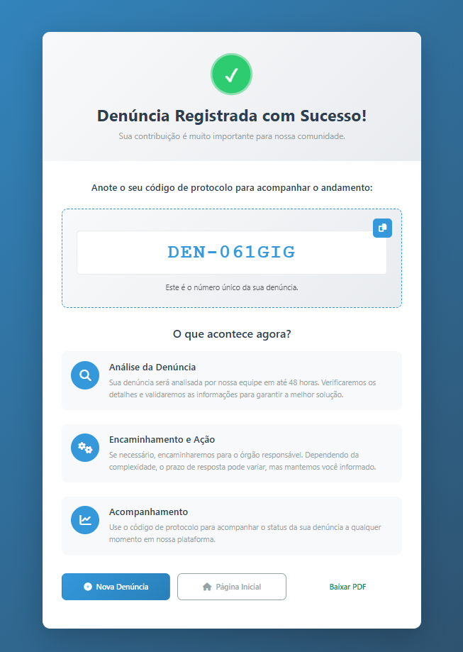
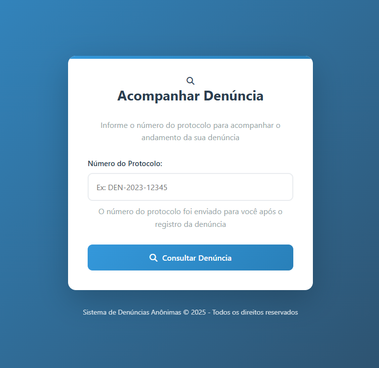
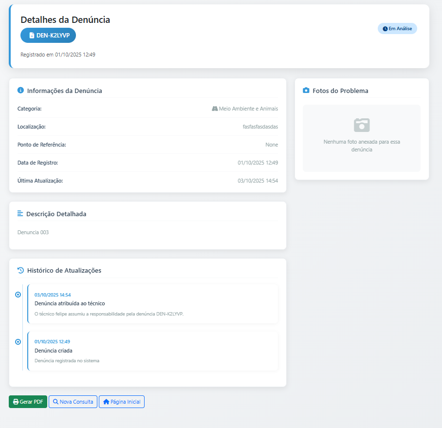

### Como Registrar uma Denúncia

1.  Acesse a página de registro de denúncia.
  
2.  Selecione a **"Categoria Principal"** que descreve seu problema (ex: "Iluminação Pública").
   
3.  No campo **"Descreva o que aconteceu"**, forneça mais detalhes sobre o problema.
4.  Clique em **"Enviar Denúncia"**.
5.  **Importante:** Anote o **Código de Protocolo** que aparece na tela de sucesso.
   
   

### Como Consultar o Status da sua Denúncia

1.  Acesse a página de "Acompanhar Denúncia".
   
2.  Digite o Código de Protocolo que você anotou.
   
3.  Clique em "Consultar".
4.  O sistema mostrará o status atual da sua denúncia (Pendente, Em Análise ou Resolvido).
   
